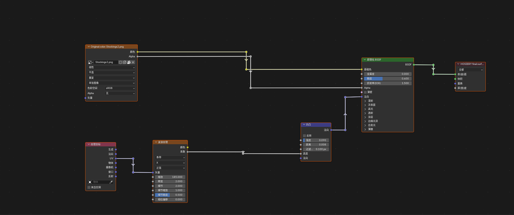
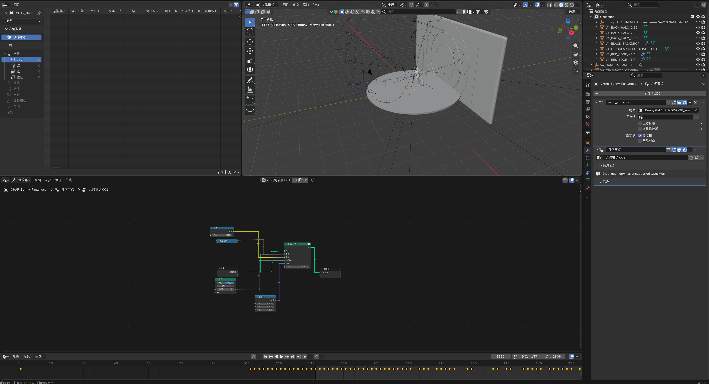
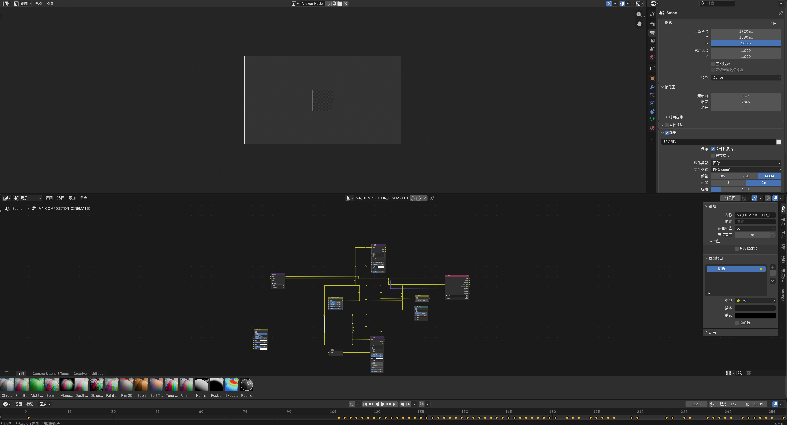

# Node Orthogonalizer for Blender 5.2

> Automatically turns Blender node links into clean, exact right-angle routes and organizes complex node trees.

Node Orthogonalizer is a maintained Blender 5.2 extension for Shader Editor,
Compositor, Geometry Nodes, and nested node groups. It creates horizontal and
vertical reroute paths, and includes manual tools for arranging selected nodes
as a readable dependency tree.

## 中文简介

Node Orthogonalizer（节点正交化器）是一款面向 Blender 5.2 LTS 的节点整理
扩展。它可以自动将着色器、合成器和几何节点的连线整理为精确的 90° 路线，
也可以按树状结构或距离重新排列选中的节点。

本版本支持进入节点组内部操作，兼容 Frame 框架、组输入/组输出、动态 Bake
插口、MMD 材质节点和大型合成器节点树，并针对复杂预设的卡顿问题进行了优化。

## Features

- Automatic orthogonal routing after nodes or links change.
- Manual command from `F3`: **Node Orthogonalize**.
- Default shortcut: `Shift + ,`.
- Exact horizontal and vertical reroute alignment in Blender 5.2.
- Shader Editor, Compositor, Geometry Nodes, and nested node-group support.
- Dynamic Geometry Nodes Bake socket support.
- Frame-safe processing that preserves node parenting, data, sockets, and links.
- Debounced automatic processing for better performance on large node groups.
- **Tree Layout (Selected)** for left-to-right dependency columns.
- **Compact Selected by Distance** for shorter links.
- **Optimize Group Input / Output** for cleaner group interfaces.

## Installation

1. Download `node-orthogonalizer-blender-5.2-v2.1.2.zip` from the latest GitHub Release.
2. In Blender 5.2, open **Edit > Preferences > Extensions**.
3. Open the menu in the upper-right corner and choose **Install from Disk**.
4. Select the downloaded ZIP without extracting it.
5. Enable **Node Orthogonalizer**, then restart Blender if replacing an older version.

## Usage

Automatic routing is enabled by default. After moving nodes or changing links,
the extension waits briefly for the node editor to settle and then processes the
active node tree.

For manual routing, select the relevant nodes and use **F3 > Node Orthogonalize**
or press `Shift + ,`.

### Layout panel

1. Move the mouse over the node editor and press `N`.
2. Open **Orthogonalizer > Node Orthogonalizer** on the right-hand sidebar.
3. Select connected nodes or select a Frame containing the nodes.
4. Choose one of the layout tools:
   - **Tree Layout (Selected)**
   - **Compact Selected by Distance**
   - **Optimize Group Input / Output**
   - **Create 90-Degree Routes**

The `N` key affects the editor under the mouse cursor. If the cursor is over the
3D Viewport, Blender opens the 3D Viewport sidebar instead of the node-editor panel.

For safety, complex framed presets require a node or Frame selection before the
layout tools rearrange them. Simple unframed trees can be organized as a whole.

## Compatibility and validation

Version 2.1.2 was tested with Blender 5.2.0 LTS in:

- Shader nodes, including Principled BSDF and MMD material groups.
- Compositor node trees.
- Geometry Nodes, including dynamic Bake sockets and Domain Size.
- Nested node groups and Frame-parented nodes.
- A production-style preset containing 133 nodes, 167 links, 61 reroutes, and 8 frames.

The original `.blend` test files were not overwritten.

## Screenshots

### Shader node routing

### Geometry Nodes complex scene

### Compositor complex scene

## Changelog

### 2.1.2

- Prepared the package metadata and lifecycle behavior for Blender Extensions review.
- Removed the NumPy dependency and now use Python's standard math library only.
- Registered internal Blender RNA properties only while the extension is enabled.
- Added collision-safe property names and complete cleanup on unregister.
- Added the official `Node` extension tag and corrected the manifest website field.

### 2.1.1

- Added an **Orthogonalizer** tab to the node editor's `N` sidebar.
- Kept the panel visible in every Node Editor, including before a node tree is active.
- Clarified that the mouse must be over the Node Editor when pressing `N`.

### 2.1.0

- Added tree, compact-distance, and Group Input/Output layout tools.
- Added selected-node, Frame, and nested node-group processing.
- Preserved Frame parenting and existing reroute constraints during layout.
- Reduced automatic-mode feedback loops and slowdowns on complex node groups.
- Improved exact 90° alignment across Shader, Compositor, and Geometry Nodes.

### 2.0.0

- Renamed the maintained add-on to **Node Orthogonalizer**.
- Added Blender 5.2 socket-layout handling and dynamic Bake support.

## Credits and license

This project is a Blender 5.2 modernization and expansion of the open-source
**Square Noodles** add-on by Kai Christensen:
[mkaic/square-noodles](https://github.com/mkaic/square-noodles).

Blender 5.2 rewrite, automatic mode, performance work, nested-group support,
exact reroute alignment, and layout tools are maintained by Andy294753951.

Distributed under the GNU General Public License v3.0 or later. See [`LICENSE`](LICENSE).
